# Σχεδιαση Εφαρμογης 
Το **UniVerse** είναι μια εφαρμογή που προορίζεται για χρήση από φοιτητές και τη Γραμματεία της σχολής μας. 
Έτσι, έχουμε 2 ρολους που μπορούν να κάνουν log in στην εφαρμογή μας και να διαδραματίσουν τις ενέργειες που περιγράφονται στα use cases.

Για την είσοδο του <b>χρήστη</b> στην εφαρμογή χρησιμοποιούνται τα εξής views:
1. **Logo** 
    <ul>
    Πατώντας στην εικόνα του Logo ο χρήστης ανακατευθύνεται στην οθόνη Αυθεντικοποίησης 

    </ul>
    
    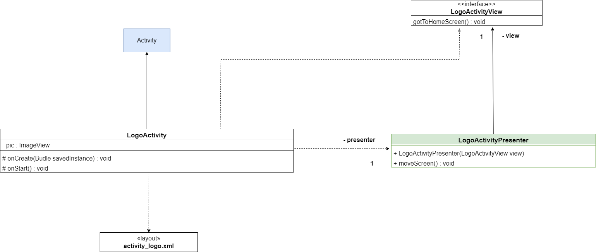
2. **Authentication**
    <ul>
    Ο χρήστης επιλέγει τον ρόλο του μέσω ενώ switch και κάνει την αυθεντικοποίηση με βάση το id και τον κωδικό που είναι αποθηκευμένοι στο σύστημα
    </ul>

    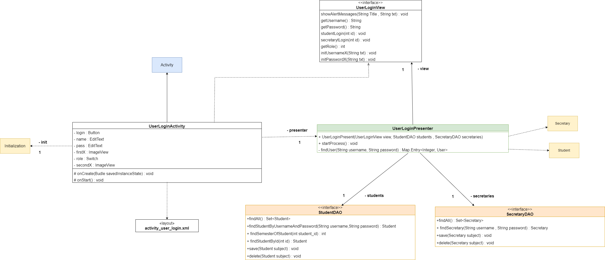

Για τον ρόλο του <b>φοιτητή</b> έχουμε τα εξής views:
1. **HomeStudentFragment**
    <ul>
        Περιέχει το log out button. 
    </ul>

    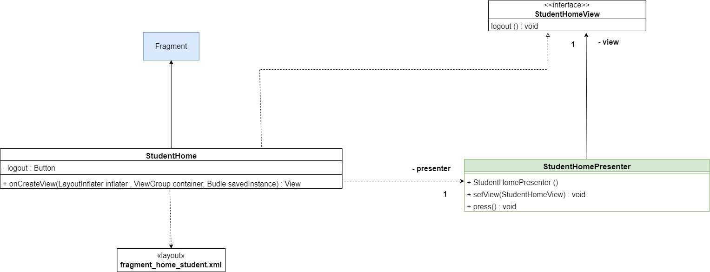
1. **Student**
    <ul>
        Το Activity για τον φοιτητή. Μέσω του navigation bar ανακατευθύνει τον φοιτητή στα αντίστοιχα fragments & views. 
    </ul>

    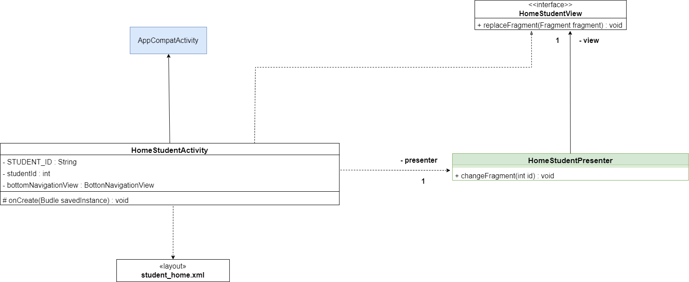
2. **Submission**
    <ul>
        Το Fragment που εκτελεί την δήλωση μαθημάτων του φοιτητή. Περιέχει πίνακα με τα προσφερόμενα μαθήματα για το αντιστοιχο εξάμηνο που βρίσκεται ο φοιτητής (εαρινό - χειμερινό). Ο φοιτητής επιλέγει τα μαθήματα που θέλει να δηλώσει, εκτελούνται οι απαραίτητοι έλεγχοι για τις προυποθέσεις και καταχωρείται η δήλωση (ή γίνεται ενημέρωση για μη-έγκυρη δήλωση) 
    
    </ul>

    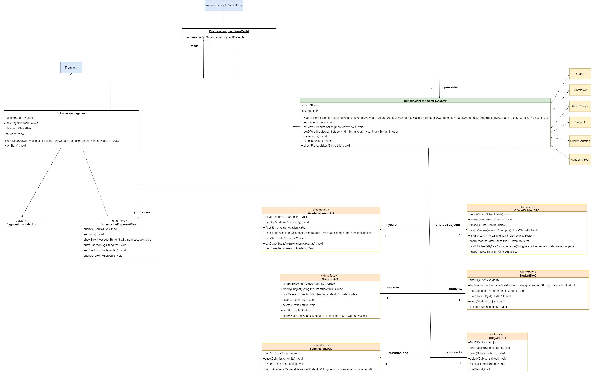
3. **Search**
    
    <ul>
        <li> <b>SearchFragment</b>
         
        Το Fragment που περιέχει πίνακα με όλα τα προσφερόμενα μαθήματα. Ο φοιτητής μπορεί να κάνει αναζήτηση για κάποιο μάθημα με βάση τον τίτλο του μαθήματος, να πατήσει σε αυτό και να δει τις πληροφορίες που αφορούν σε αυτό (μέσω της ανακατεύθυνσης στο παρακάτω Activity) 
        </li> 
        
    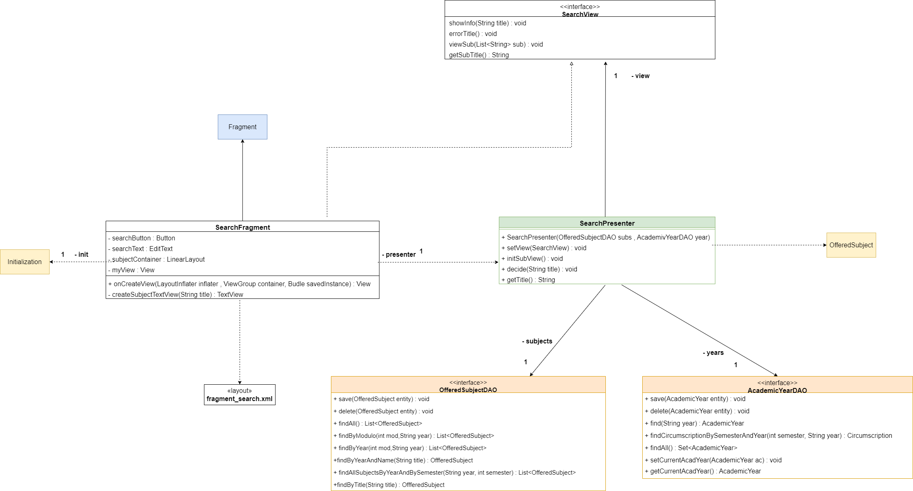
    
    </ul>
        <li><b>Information</b>
         
        Περιέχει και παρουσιάζει τις πληροφορίες για τα μαθήματα όπως τιτλος, id, ects, περιγραφή, καθηγητής και προαπαιτούμενα μαθήματα
        </li>
    </ul>

    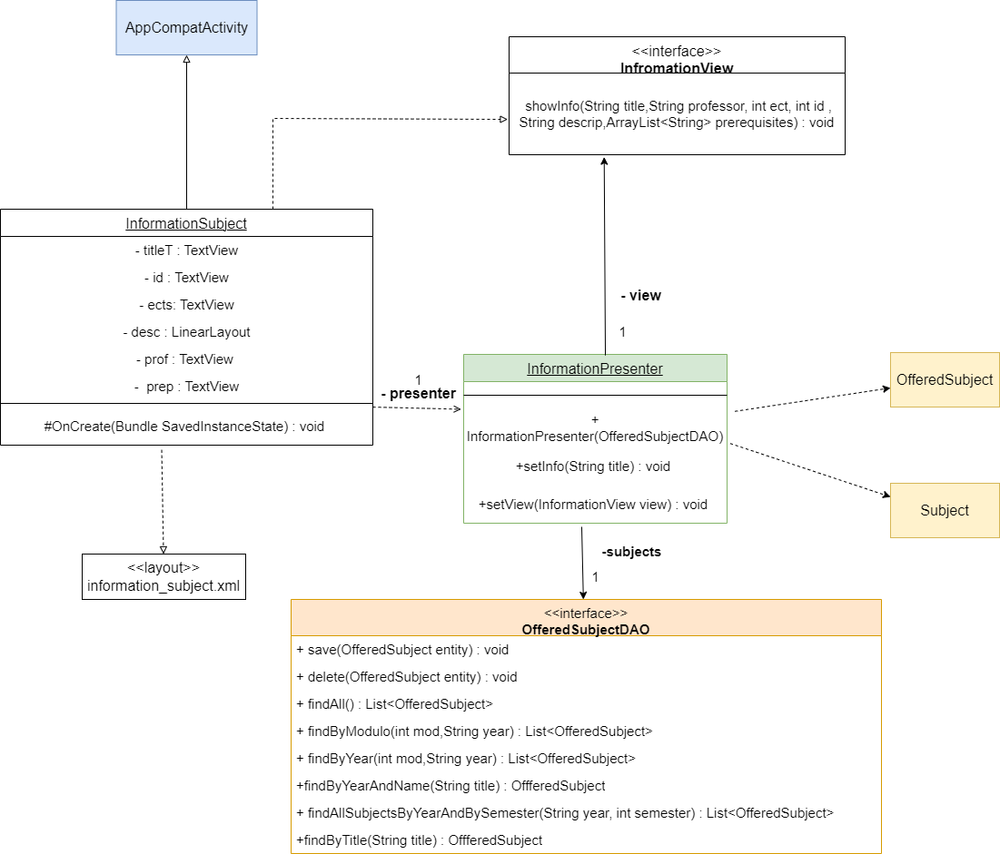

4. **Progress**
    <ul>
        <li> <b>ProgressForm</b>
         
        Το Fragment που περιέχει πληροφορίες όπως ο γενικός μέσος όρος και ο μέσος όρος ανά εξάμηνο, τα συνολικά ects του φοιτητή, τον αριθμό περασμένων μαθημάτων του καθώς και το κουμπί για τους λεπτομερείς βαθμούς (μέσω της ανακατεύθυνσης στο παρακάτω Activity) 
        </li> 
        <li><b>DetailedGrades</b>
         
        Περιέχει και παρουσιάζει με Dynamic List τα μαθήματα που έχει εξεταστεί ο φοιτητής μαζί με τον βαθμό τους χωρισμένα ανά εξάμηνο, όπως και τον μέσο όρο για το κάθε εξάμηνο ξεχωριστά.
        </li>
    </ul>

Για τον ρόλο της <b>Γραμματείας</b> έχουμε τα εξής views:
1. **SecretaryHomeFragment**
    <ul>
        Περιέχει το log out button. 
    </ul>

    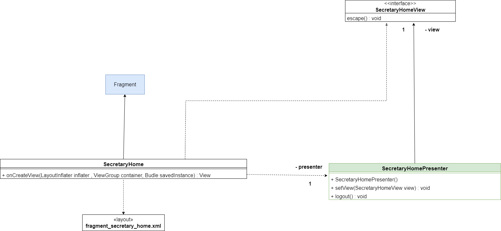
2. **Secretary**
    <ul>
        Το Activity για την Γραμματεία. Μέσω του navigation bar ανακατευθύνει τον Γραμματέα στα αντίστοιχα fragments & views. 
    </ul>

    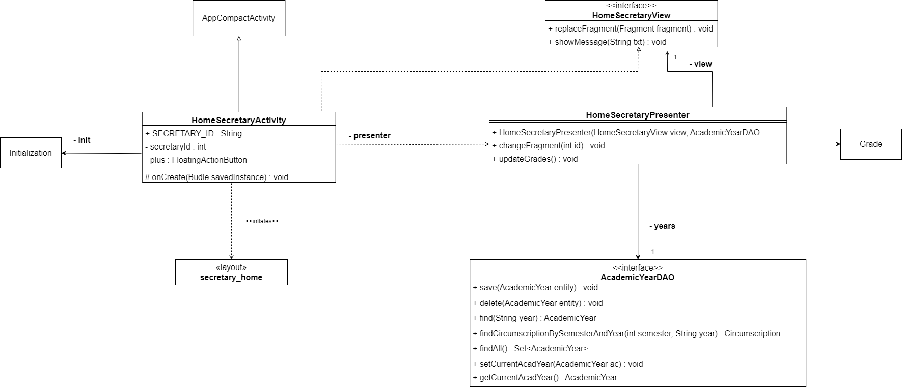
3. **AcademicYear**
    <ul>
        <li> <b>AcademicYearForm</b>
         
        Το Fragment που υλοποιεί την καταχώρηση ενός περιορισμού. Περιέχει spinner για την επιλογή ακαδημαικού έτους (μεταξύ όσων έχουν δημιουργηθεί), spinner για την επιλογή του εξαμήνου, καθώς και αντίστοιχα πεδία για τη συμπλήρωση των ects, και των ημερομηνιών. Εκτελεί τον έλεγχο της δήλωσης και την καταχώρηση ή την επικάλυψη της (έαν είναι έγκυρη) 
        </li> 

    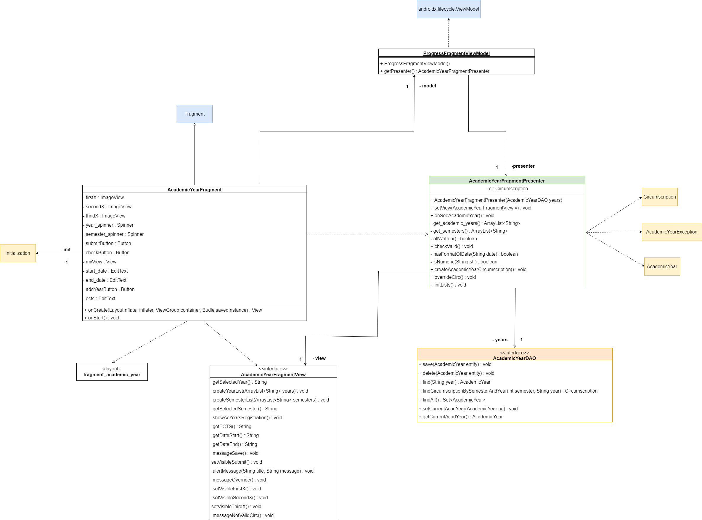
    </ul>
        <li><b>Registration</b>
         
        Το Activity που εκτελεί την δημιουργία νέου ακαδημαικού έτους. Ο Γραμματέας εισάγει τα κατάλληλα στοιχεία (ακαδημαικό έτος, ημερομηνίες) και το σύστημα εκτελεί την καταχώρηση. Αν υπάρχει ήδη το ακαδημαικό έτος εμφανίζεται κατάλληλο μήνυμα.   
        </li>
    </ul>

    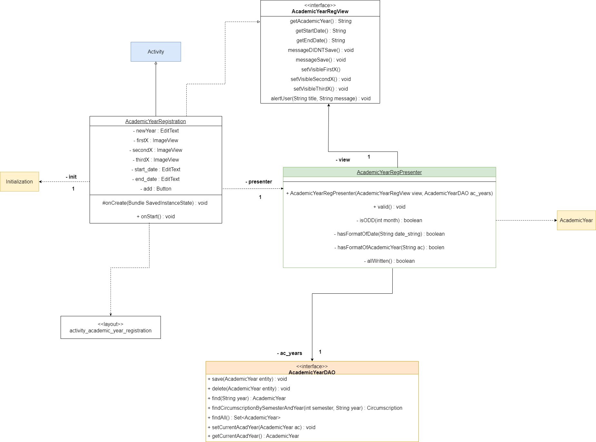
4. **OfferedSubject**
    <ul>
        <li> <b>OfferedSubjectForm</b>
         
        Το Fragment στο οποίο ο Γραμματέας επιλέγει ακαδημαικό έτος και εξάμηνο. Πατώντας το κουμπί continue το σύστημα ελέγχει αν υπάρχει έστω ένα προσφερόμενο μάθημα και εκτελεί υπερκάλυψη εάν αυτό επιλεγεί από το χρήστη 
        </li> 

    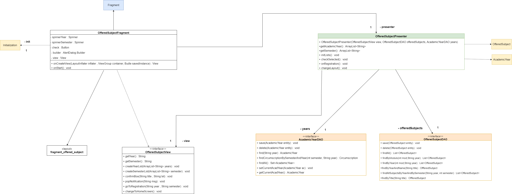
    </ul>
        <li><b>OfferedSubjectRegistration</b>
         
        Το Activity κατά το οποίο ο Γραμματέας επιλέγει τα μαθήματα που θέλει να γίνουν προσφερόμενα για ένα συγκεκριμένο ακαδημαικό έτος και εξάμηνο.
        </li>
    </ul>

    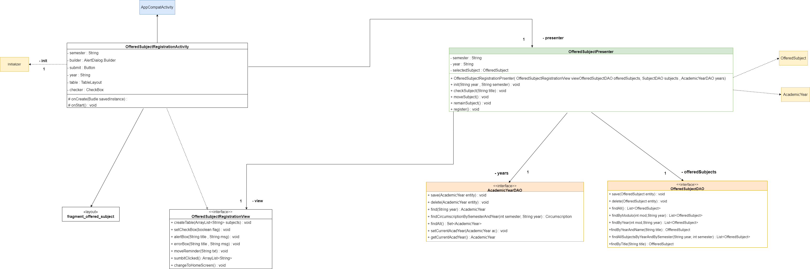
    
5. **Subject**
    <ul>
        <li> <b>SubjectFragment</b>
         
        Το Fragment στο οποίο ο Γραμματέας επιλέγει να καταχωρήσει νέο Μάθημα (μέσω της ανακατεύθυνσης στο παρακάτω Activity).
        </li> 
        
     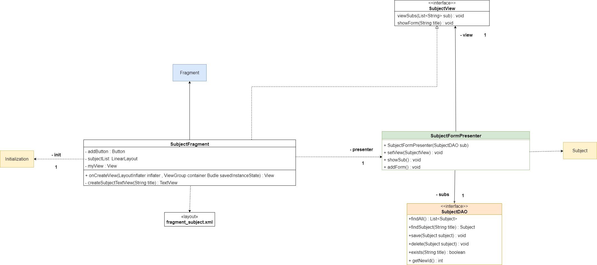
    </ul>
        <li><b>SubjectAdd</b>
         
        Το Activity κατά το οποίο ο Γραμματέας επιλέγει να καταχωρήσει νέο μάθημα. Εισάγει στοιχεία όπως ο τίτλος, η περιγραφή, τα ects, ο καθηγητής, και τα προαπαιτούμενα. 
        </li>
    </ul>

    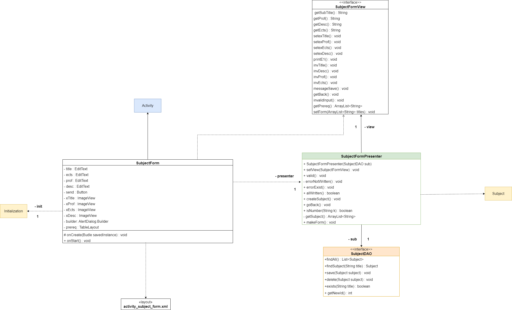
   

**Σημείωση:**  
Όλα τα Activities και τα Fragments που δημιουργήθηκαν συμμορφώνονται με τα αντίστοιχα UseCases και τα Requirements.

 

## Coverage Report

 

**DAO & MEMORY DAO**
 

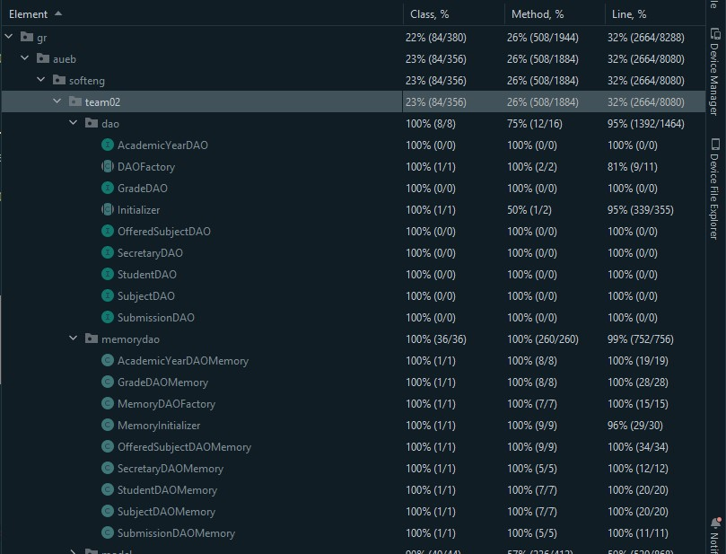

 

**MODEL**
 

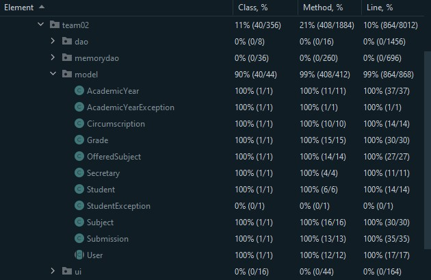

 

**VIEW**

 

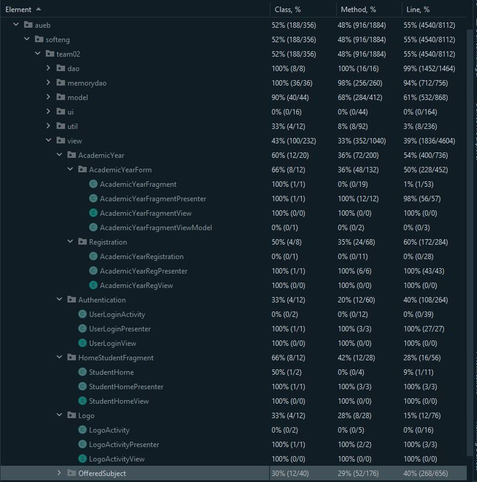

 

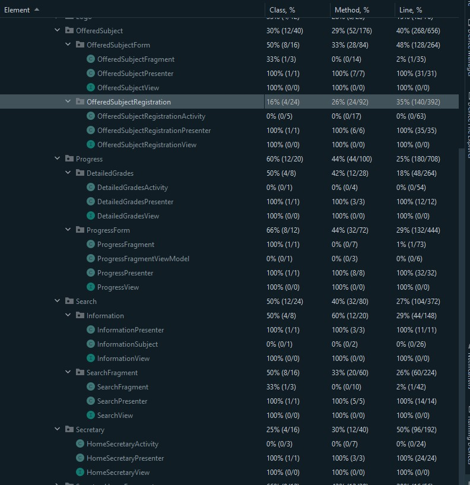

 

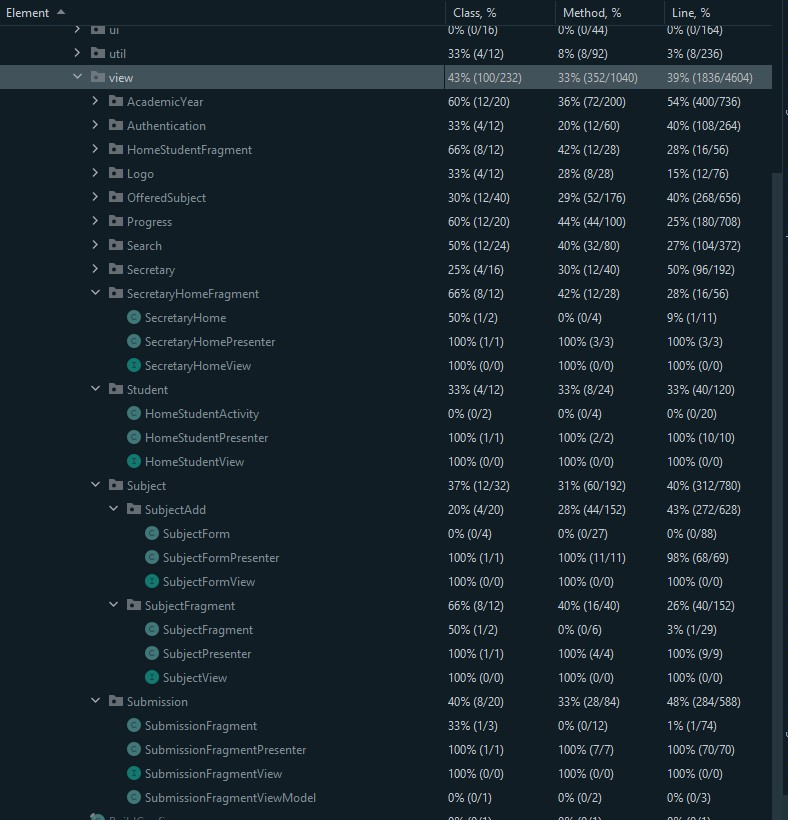

 

## Metrics 
### Class Metrics
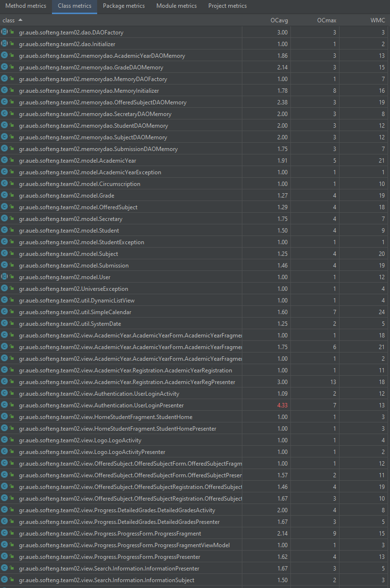

 

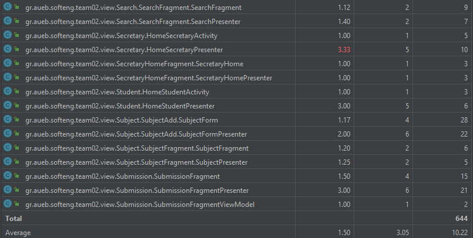

 

### Module Metrics
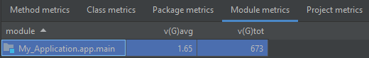

 

### Package Metrics

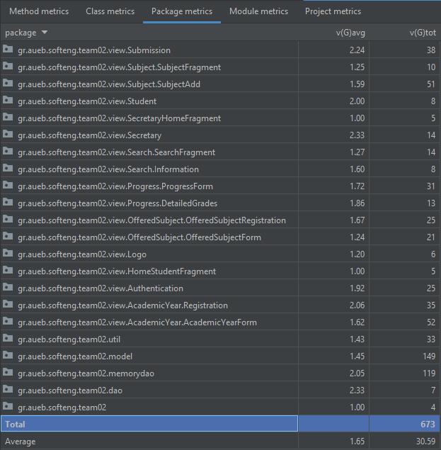

 

### Project Metrics
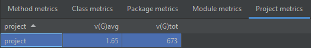
