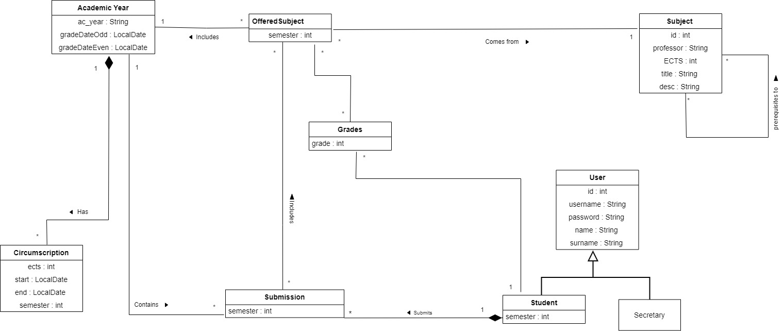
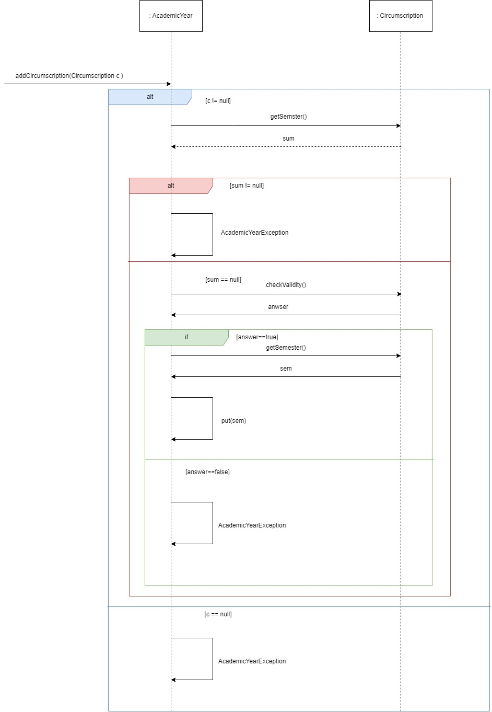

\[*Παρακάτω δίνεται μία περιγραφή του περιεχομένων του Εγγράφου Προδιαγραφών Απαιτήσεων Λογισμικού (ΕΠΑΛ) που βασίζεται σε πρότυπο περιπτώσεων χρήσης. Για κάθε ενότητα του εγγράφου γίνεται παραπομπή σε παραδείγματα του βιβλίου “Μ Γιακουμάκης, Ν. Διαμαντίδης, Τεχνολογία Λογισμικού, Σταμούλης, 2009”. Το παράδειγμα ενός συστήματος Τράπεζας έχει σχεδιαστεί από τον Β.Ζαφείρη στα πλαίσια φροντιστηρίων του μαθήματος Τεχνολογία Λογισμικού του Τμήματος Πληροφορικής του ΟΠΑ.*\]

# Εισαγωγή

\[*Μία εισαγωγή που αφορά το παρόν έγγραφο.*\]

## Εμβέλεια

\[*Περιγράφουμε τι θα κάνει και κυρίως τι δεν θα κάνει το λογισμικό. Βλέπε παράδειγμα 3-2 του βιβλίου στη σελίδα 139.*

*Ένα διάγραμμα περιβάλλοντος (πρωταρχικό διάγραμμα ροής δεδομένων) που βοηθά στην κατανόηση του συστήματος σε σχέση με το περιβάλλον του. Βλέπε το σχήμα 4-12 του παραδείγματος 4-1 στη σελίδα 185 του βιβλίου*\]

## Ορισμοί ακρώνυμα και συντομογραφίες

\[*Ένας πίνακας ακρωνύμων και συντομογραφιών που χρησιμοποιούνται στο έγγραφο. Ένας δεύτερος πίνακας με ορισμούς. Οι ορισμοί λαμβάνονται από το γλωσσάρι αν αυτό υπάρχει. Βλέπε πίνακα 3-5 του παραδείγματος 3-1 στη σελίδα 134.*\]

## Αναφορές

\[*Γράφουμε αν υπάρχουμε αναφορές σε άλλα έγγραφα (μελέτη σκοπιμότητας, ΕΠΑΣ, επιχειρησιακά μοντέλα κλπ). Σε περίπτωση που κάποια πληροφορία περιλαμβάνεται σε άλλο έγγραφο γίνεται η αναφορά στο άλλο έγγραφο και δεν επαναλαμβάνεται στο ΕΠΑΛ).*\]

## Επισκόπηση

\[*Γράφουμε πως οργανώνεται το υπόλοιπο έγγραφο*\]

# Συνολική περιγραφή

## Επισκόπηση μοντέλου περιπτώσεων χρήσης

*Εισάγουμε έναν πίνακα με τους κωδικούς, τους τίτλους και μία σύντομη περιγραφή των περιπτώσεων χρήσης. Βλέπε πίνακα 3-8 του παραδείγματος 3-11 στη σελίδα 168 του βιβλίου*

## Υποθέσεις και εξαρτήσεις

\[*Γράφουμε τις υποθέσεις που κάνουμε και τις εξαρτήσεις του συστήματος σε σχέση με το περιβάλλον του.*\]

# Ειδικές Απαιτήσεις

## Περιπτώσεις χρήσης

### Οι ενδιαφερόμενοι και οι ανάγκες τους

\[*Ένας πίνακας των ενδιαφερομένων (stakeholders) με τις ανάγκες τους. Βλέπε πίνακα 3-6 του παραδείγματος 3-2 στη σελίδα 138 του βιβλίου.*\]

### Actors του συστήματος

\[*Ένα πίνακας με του actors του συστήματος. Βλέπε πίνακας 3-7 παραδείγματος 3-11 στη σελίδα 167 του βιβλίου.*\]

### Περιγραφές περιπτώσεων χρήσης

---

| Περιπτώσεις χρήσης | Τίτλος | Περιγραφή |
| :-----| :--------------| :------------------------------|
| ΠΧ 1 | Ταυτοποίηση Χρηστών | Το σύστημα ταυτοποιεί και ευθεντικοποιεί τους χρήστες (Γραμματεία & Φοιτητές)|
| ΠΧ 2 | Καταχώρηση Μαθημάτων | Ο Υπεύθυνος Γραμματείας καταχωρεί τα μαθήματα (πληροφορίες κλπ ) της σχολής  |
| ΠΧ 3 | Καταχώρηση Προυποθέσεων | Ο Υπεύθυνος Γραμματείας εισαγάγει τον περιορισμό των ECTS που μπορούν να δηλωθούν από τους φοιτητές ανά εξάμηνο (ανάλογα με το έτος φοίτησης).|
| ΠΧ 4 | Καταχώρηση Προσφερόμενων Μαθημάτων | Ο Υπεύθυνος Γραμματείας επιλέγει και καταχωρεί τα μαθήματα που θα προσφερθούν το συγκεκριμένο έτος |
| ΠΧ 5 | Αναζήτηση Πληροφοριών Μαθημάτων | Ο φοιτητής βλέπει τις πληροφορίες που τον ενδιαφέρουν για τα μαθήματα που προσφέρονται. (Τίτλος, ECTS, αλυσίδες, προαπαιτούμενα) |
| ΠΧ 6 | Δήλωση Μαθημάτων | Ο φοιτητής επιλέγει τα μαθήματα στα οποία θέλει να εξεταστεί το τρέχον εξάμηνο, όταν αυτό γίνει διαθέσιμο από το Ημερολόγιο Συστήματος |
| ΠΧ 7 | Καταχώρηση Βαθμών | Το φοιτητολόγιο καταχωρεί τους βαθμούς των φοιτητών στα μαθήματα που δήλωσαν, μετά την ενεργοποίηση της λειτουργίας από το Ημερολόγιο Συστήματος |
| ΠΧ 8 | Προβολή Στατιστικών Στοιχείων | Ο φοιτητής δύναται να βλέπει τους βαθμούς του καθώς και στατιστικά στοιχεία προόδου |

#### [ ΠΧ 1 Ταυτοποίηση Χρηστών ]( uc1-user-authentication.md)
#### [ ΠΧ 2 Καταχώρηση Μαθημάτων ]( uc2-subject-registration.md)
#### [ ΠΧ 3 Καταχώρηση Προυποθέσεων ]( uc3-circumscription-of-course-registration.md)
#### [ ΠΧ 4 Καταχώρηση Προσφερόμενων Μαθημάτων ]( uc4-offered-subjects-registration.md)
#### [ ΠΧ 5 Αναζήτηση Πληροφοριών Μαθημάτων ]( uc5-course-info-presentation.md)
#### [ ΠΧ 6 Δήλωση Μαθημάτων ]( uc6-course-submission.md)
#### [ ΠΧ 7 Καταχώρηση Βαθμών ]( uc7-new-grades-upload.md)
#### [ ΠΧ 8 Προβολή Προόδου Φοιτητή ]( uc8-progress-review.md)

## Συμπληρωματικές προδιαγραφές

\[*Οι επόμενες ενότητες περιέχουν όλες τις μη λειτουργικές απαιτήσεις και τους περιορισμούς σχεδίασης και υλοποίησης.*\]

### Απαιτήσεις διεπαφών

#### Διεπαφές χρήστη
-   Το σύστημα εμφανίζει τα μηνύματα σφάλματος στην ελληνική γλώσσα.

#### Διεπαφές επικοινωνίας
-   Η επικοινωνία του UniVerse και του φοιτητολογίου γίνεται μέσω κοινών πρωτοκόλλων μέσω δικτύου.

#### Διεπαφές λογισμικού
- Ο χρήστης μπορεί να επιδράσει με την εφαρμογή μέσω GUI (touch screen, keyboard).

### Περιορισμοί σχεδίασης και υλοποίησης
-   Για την ανανέωση βαθμών απαιτεί σύνδεση της εφαρμογής με το WiFi.
-   Για την σύνδεση στο σύστημα απαιτείται εγκατάσταση της εφαρμογής σε PC ή κινητό τηλέφωνο.

### Ποιοτικά χαρακτηριστικά

#### Απόδοση
-   Η ανανέωση των στατιστικών στοιχείων μετά το πέρασμα των βαθμών στο σύστημα από το φοιτητολόγιο γίνεται σε **άμεσο χρονικό διάστημα** μετά τον έλεγχο του πέρατος της καταληκτικής ημερομηνίας από το ημερολόγιο συστήματος.

#### Διαθεσιμότητα
-   Το σύστημα επιτρέπει την πρόσβαση των εξουσιοδοτημένων χρηστών στην πληροφορία, σε εύλογο χρόνο.

#### Ασφάλεια
-   Το σύστημα αποκρύπτει τις λειτουργίες μεταξύ διαφορετικών εξουσιοδοτημένων ρόλων(Εμπιστευτικότητα).
-   Το σύστημα διασφαλίζει την τροποποίηση πληροφοριών από εξουσιοδοτημένους χρήστες.
-   Το σύστημα υποστηρίζει την ασφαλή πρόσβαση των χρηστών στο σύστημα.

#### Ευχρηστία
-   Το σύστημα καθοδηγεί τον χρήστη στην δήλωση μαθημάτων με απλά βήματα και κατανοητά μηνύματα.
-   Σε περιπτώσεις απροσεξίας ή λάθους εκ παραδρομής, ο χρήστης επιστρέφει στην προηγούμενη κατάσταση (όχι από την αρχή -> κουμπί επιστροφής) και παρέχει μηνύματα ανάδρασης όπου αυτά χρειάζονται.

#### Συμμόρφωση
-   Το σύστημα πρέπει να υποστηρίζεται σε λειτουργικό σύστημα Android.

# Υποστηρικτικό υλικό

## Μοντέλο πεδίου

## Ανάλυση περιπτώσεων χρήσης
--------------------------

### Κλάσεις ανάλυσης

---

---
 
---
 

### Συμπεριφορές

| Επιχειρησιακοί κανόνες | Περιγραφή                                                                |
| :----------------------|:-------------------------------------------------------------------------|
| ΕΚ1 | Το κατώτατο όριο είναι 30 ECTS και το ανώτατο όριο ειναι 130 ECTS ανά εξάμηνο |
| ΕΚ2 | Ο κωδικός και το όνομα του φοιτητή είναι μοναδικά |
| ΕΚ3 | Κάθε φοιτητής για να δηλώσει ένα μάθημα πρέπει να έχει περάσει ένα τουλάχιστον ένα από τα προαπαιτούμενα μαθήματα |