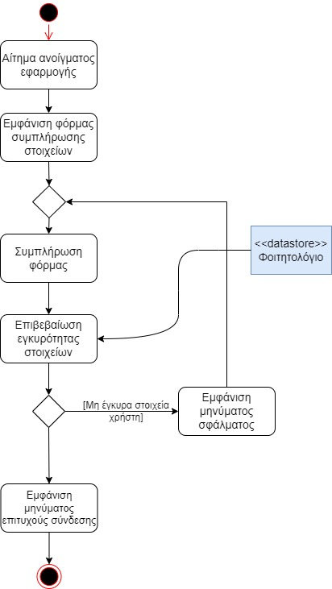

# ΠΧ1. Ταυτοποίηση Χρήστη

**Πρωτεύων Actor**: Χρήστης (Υπεύθυνος Γραμματείς & Φοιτητής)

**Ενδιαφερόμενοι**:

**Υπεύθυνος Γραμματείας**: Η γραμματεία θέλει να έχουν πρόσβαση στο σύστημα μόνο authorized users (ακεραιότητα) .

**Φοιτητής**: Ο φοιτητής θέλει να είναι ο μοναδικός που έχει πρόσβαση στις πληροφορίες του (εμπιστευτικότητα)

**Προϋποθέσεις**: -

## Βασική Ροή
1. Το σύστημα εμφανίζει στον χρήστη την φόρμα συμπλήρωσης στοιχείων.
2. Ο Χρήστης συμπληρώνει τα στοιχεία του
3. Το σύστημα ελέγχει την ορθότητα των στοιχείων (username, password) με βάση το φοιτητολόγιο 
4. Το σύστημα εμφανίζει μήνυμα επιτυχούς σύνδεσης

## Εναλλακτικές Ροές

*3α. Τα στοιχεία που συμπληρώθηκαν δεν είναι έγκυρα*
1. Το σύστημα εμφανίζει μήνυμα σφάλματος.
2. Η περίπτωση χρήσης επιστρέφει στο βήμα 2.

## Διαγράμματα 
**Διάγραμμα Δραστηριοτήτων**

---
