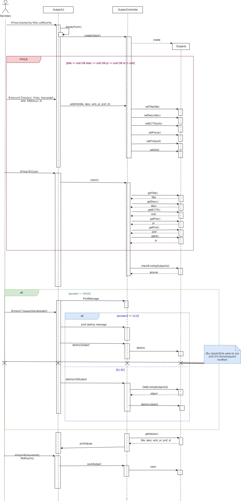

# ΠΧ2. Καταχώρηση Μαθημάτων

**Πρωτεύων Actor**: Υπεύθυνος Γραμματείας  
**Ενδιαφερόμενοι**
**Υπεύθυνος Γραμματείας**: Θέλει να δημιουργήσει ένα κατάλογο μαθημάτων που θα φαίνονται όλες οι απαραίτητες πληροφορίες στους φοιτητές.  
**Φοιτητής**: Θέλει να μπορεί βλέπει τις πληροφορίες των μαθημάτων.  
**Προϋποθέσεις**: Ο Υπεύθυνος Γραμματείας έχει εκτελέσει με επιτυχία την περίπτωση χρήσης “Ταυτοποίηση χρήστη”.  

## Βασική Ροή

### Καταχώρηση μαθημάτων

1. Ο Υπεύθυνος Γραμματείας επιλέγει την Εισαγωγή Νέου Μαθήματος.
2. Το σύστημα εμφανίζει τη φόρμα συμπλήρωσης  
3. Ο Υπεύθυνος Γραμματείας συμπληρώνει τα στοιχεία του μαθήματος (Τίτλος, Περιγραφή, ECTS, προαπαιτούμενα, Διδάσκων)
4. Το σύστημα επιβεβαιώνει την εγκυρότητα των στοιχείων της αίτησης (αν έχουν συμπληρωθεί όλα τα πεδία, αν έχει ήδη καταχωρηθεί το μάθημα).
5. Το σύστημα εμφανίζει την προεπισκόπηση της εισαγωγής.
6. Ο Γραμματέας ολοκληρώνει την καταχώρηση.
7. Το σύστημα καταχωρεί το μάθημα.
8. Το σύστημα εμφανίζει μήνυμα Επιτυχούς Καταχώρησης.

## Εναλλακτικές Ροές

*Σε οποιοδήποτε σημείο το λογισμικό καταρρέει.
1. Ο Υπεύθυνος Γραμματείας εκκινεί το Σύστημα.
2. Το Σύστημα ταυτοποιεί τον Υπεύθυνο Γραμματείας.
3. Ο Υπεύθυνος Γραμματείας εκκινεί την περίπτωση χρήσης από την αρχή.
---
*4α. Δεν έχουν συμπληρωθεί όλα τα πεδία*
1. Το σύστημα εμφανίζει σχετικό μήνυμα, και με κόκκινα αστεράκια τα πεδία που δεν έχουν συμπληρωθεί.
2. Το σύστημα επιστρέφει στο Βήμα 3.

*4β. Το μάθημα είναι ήδη καταχωρημένο*
1. Το σύστημα εμφανίζει μήνυμα στον Υπέυθυνο Γραμματείας σχετικά με το ποιό από τα 2 μαθήματα θέλει να κρατήσει (Παλιά ή καινούρια "έκδοση").
2. Ο Υπεύθυνος Γραμματείας κάνει την επιλογή.
    * 2α. Ο Υπεύθυνος Γραμματείας επέλεξε την παλιά έκδοση
        1. Το σύστημα ακυρώνει την καταχώρηση του τρέχοντος μαθήματος.
        2. Το σύστημα εμφανίζει κατάλληλο μήνυμα.  
        3. Η περίπτωση χρήσης τερματίζεται.
    * 2β. Ο Υπεύθυνος Γραμματείας επέλεξε την καινούρια έκδοση.
        1. Το σύστημα διαγράφει το "παλιό" μάθημα.
        2. Το σύστημα επιστρέφει στο Βήμα 5.
---
*5α. Ο Υπεύθυνος Γραμματείας πατάει το κουμπί Επιστροφή*
1. Το Σύστημα επιστρέφει στο Βήμα 3.

## Διαγράμματα 
**Διάγραμμα Δραστηριοτήτων**

------

**Διαγραμμα Ακολουθίας**

