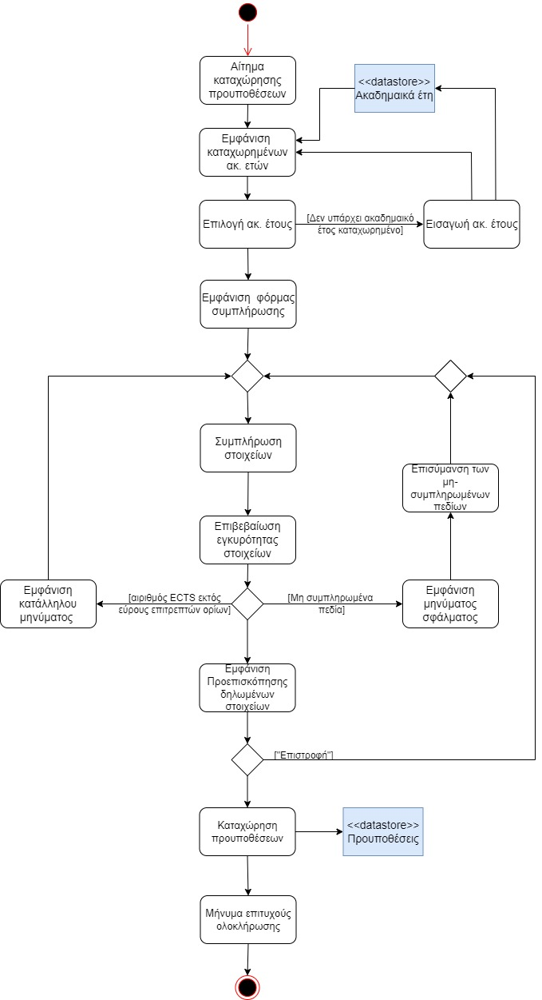

# ΠΧ3. Διαχείρηση Ακαδημαικού έτους

**Πρωτεύων Actor**: Υπεύθυνος Γραμματείας  

**Ενδιαφερόμενοι:**

- **Υπεύθυνος Γραμματείας**: Θέλει να περιορίσει (έμμεσα) τον αριθμό των μαθημάτων που μπορεί ο φοιτητής να δηλώσει ανάλογα με το έτος που φοιτεί.  
- **Φοιτητής**: Θέλει να μπορεί βλέπει μέχρι πόσα ECTS μπορεί να δηλώσει.  
**Προϋποθέσεις**: Ο Υπεύθυνος Γραμματείας έχει εκτελέσει με επιτυχία την περίπτωση χρήσης “Ταυτοποίηση χρήστη”. 

## Βασική Ροή

### Καταχώρηση Προυποθέσεων
1. Ο Υπεύθυνος Γραμματείας επιλέγει την καταχώρηση προυποθέσεων
2. Το σύστημα εμφανίζει τα καταχωρημένα ακαδημαικά έτη.
3. Ο Υπεύθυνος Γραμματείας επιλέγει το ακαδημαικό έτος που επιθυμεί.
4. Το Σύστημα εμφανίζει την φόρμα συμπλήρωσης 
5. Ο Υπεύθυνος Γραμματείας επιλέγει το εξάμηνο φοίτησης (1,2,3,4,5,6,7,8) και εισαγάγει τον αριθμό των ECTS που μπορούν να δηλωθούν.
6. Το Συύστημα επιβεβαιώνει την εγκυρότητα των στοιχείων. (Αν ο αριθμός είναι μεγαλύτερος από 30 και μικρότερος από 130, αν έχουν συμπληρωθεί όλα τα πεδία)
7. Το Σύστημα εμφανίζει την προεπισκόπηση. 
8. Το Σύστημα καταχωρεί τις προυποθέσεις
9. Το Σύστημα εμφανίζει κατάλληλο μήνυμα. 

## Εναλλακτικές Ροές

*Σε οποιοδήποτε σημείο το λογισμικό καταρρέει.
1. Ο Υπεύθυνος Γραμματείας εκκινεί το Σύστημα.
2. Το Σύστημα ταυτοποιεί τον Υπεύθυνο Γραμματείας.
3. Ο Υπεύθυνος Γραμματείας εκκινεί την περίπτωση χρήσης από την αρχή.
---
*2α. Το ακαδημαικό έτος δεν είναι καταχωρημένο.*
1. Ο υπεύθυνος Γραμματείας εισάγει στο σύστημα το ακαδημαικό έτος
2. Το σύστημα επιστρέφει στο Βήμα 2.
---
*4α. Δεν έχουν συμπληρωθεί όλα τα πεδία*
1. Το σύστημα εμφανίζει σχετικό μήνυμα
2. Το σύστημα εμφανίζει κόκκινα αστεράκια τα πεδία που δεν έχουν συμπληρωθεί.
3. Το σύστημα επιστρέφει στο Βήμα 3.

*4β. Ο αριθμός δεν είναι εντός του κατάλληλου εύρους*
1. Το σύστημα εμφανίζει σχετικό μήνυμα
2. Το σύστημα επιστρέφει στο Βήμα 3.
---
*5α. Ο Υπεύθυνος Γραμματείας πατάει το κουμπί Επιστροφή*
1. Το Σύστημα επιστρέφει στο Βήμα 3.

## Διαγράμματα
**Διάγραμμα Δραστηριοτήτων**

---

**Διάγραμμα Ακολουθίας**

