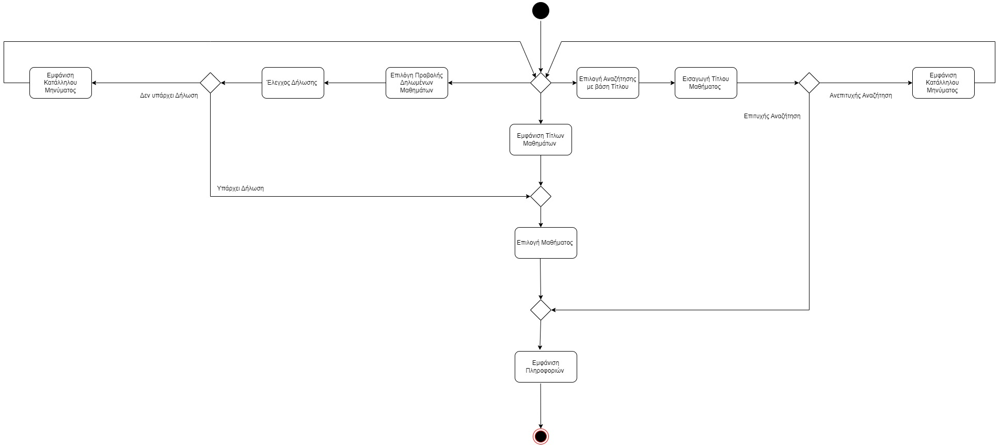

# ΠΧ5. ΑΝΑΖΗΤΗΣΗ ΠΛΗΡΟΦΟΡΙΩΝ ΜΑΘΗΜΑΤΩΝ

**Πρωτεύων Actor**: Φοιτητής  
**Ενδιαφερόμενοι**
 
**Φοιτητής**: Θέλει να μπορεί βλέπει τις πληροφορίες των μαθημάτων.

**Προϋποθέσεις** :

- Ο Φοιτητής έχει εκτελέσει με επιτυχία την περίπτωση χρήσης “Ταυτοποίηση χρήστη”. 
- Έχει ολοκληρωθεί επιτυχώς η περίπτωση χρήσης " Καταχώρηση Προσφερόμενων Μαθημάτων".

## Βασική Ροή

### Αναζήτηση πληροφοριών μαθημάτων

1. Το σύστημα του εμφανίζει τους τίτλους των προσφερώμενων μαθημάτων.
2. Ο φοιτητής επιλέγει το μάθημα για το οποίο θέλει να ενημερωθεί . 
3. Το σύστημα του εμφανίζει τις πληροφορίες του συγκεκριμένου μαθήματος(Περιγραφή, ECTS, Προαπαιτούμενα, Διδάσκων).

## Εναλλακτικές Ροές

*Σε οποιοδήποτε σημείο το λογισμικό καταρρέει.
1. Ο Φοιτητής εκκινεί το Σύστημα.
2. Το Σύστημα ταυτοποιεί τον Φοιτητή.
3. Ο Φοιτητής εκκινεί την περίπτωση χρήσης από την αρχή.
---

*1α. Ο φοιτητής επιλέγει να κάνει αναζήτηση με βάση τίτλο μαθήματος*
1. Ο φοιτητής επιλέγει το κουμπί Αναζήτησης.
2. Ο φοιτητής εισάγει το τίτλο του μαθήματος.
    * 2α. Επιτυχής Αναζήτηση 
        1. Το σύστημα επιστρέφει στο Βημα 3.
    * 2β Αποτυχής Αναζήτηση 
        1. Το σύστημα του εμφανίζει κατάλληλο μήνυμα.
        2. Ο φοιτητής επιλέγει το κουμπί Επιστροφής. 
        3. Το σύστημα επιστρέφει στο Βημα 1.
---

**Διάγραμμα Δραστηριοτήτων**

