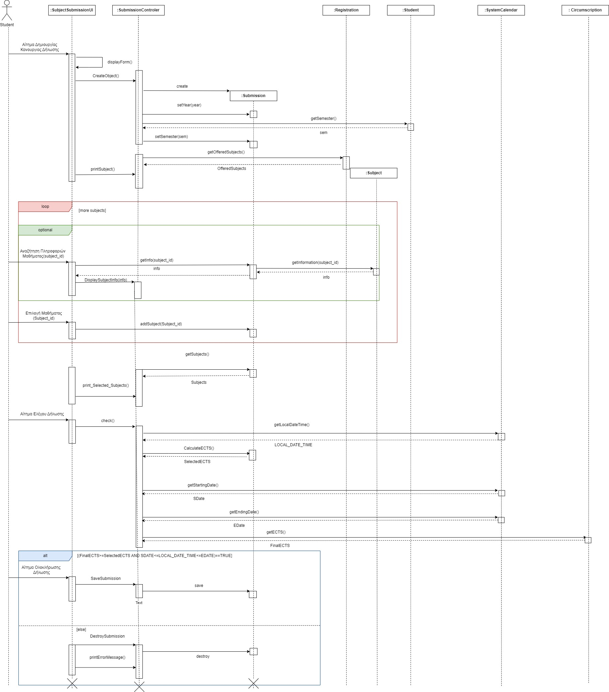

# ΠΧ6. Δήλωση μαθημάτων 

**Πρωτεύων Actor**: Φοιτητής  

**Ενδιαφερόμενοι**
 
- **Φοιτητής**: Θέλει να κάνει δήλωση των μαθημάτων που έχει σκοπό να εξεταστεί. 

**Προϋποθέσεις**: 
- Ο Φοιτητής έχει εκτελέσει με επιτυχία την περίπτωση χρήσης “Ταυτοποίηση χρήστη”. 
- Έχει ολοκληρωθεί επιτυχώς η Περίπτωση Χρήσης "Καταχώρηση Προσφερόμενων Μαθημάτων"

## Βασική Ροή

### Εμφάνιση Δήλωση μαθημάτων
1. Ο Φοιτητής επιλέγει την Δήλωση Μαθημάτων.
2. Το σύστημα εμφανίζει την φόρμα επιλογής μαθημάτων.
3. Ο φοιτητής επιλέγει, άμα επιθυμεί, να δει τις πληροφορίες κάποιου μαθήματος ([αναζήτηση  πληροφοριών μαθήματος]( uc5-course-info-presentation.md ) ), πριν το δηλώσει.
4. Ο χρήστης δηλώνει το μάθημα που επιθυμεί.
5. Ο χρήστης επιλέγει, άμα επιθυμεί, να δηλώσει καινούριο μάθημα.
6. Το σύστημα εμφανίζει λίστα με τα μαθήματα που έχει επιλέξει ο φοιτητής.
7. Το σύστημα ελέγχει τη δήλωση (αν πληροί τις προυποθέσεις προαπαιτούμενων και συνόλου ECTS).
8. Ο φοιτητής ολοκληρώνει την δήλωσή του.
9. Το σύστημα εμφανίζει μήνυμα επιτυχούς ολοκλήρωσης.

Τα βήματα 3-4-5 επαναλαμβάνονται για όσα μαθήματα θέλει ο φοιτητής.

## Εναλλακτικές Ροές

*Σε οποιοδήποτε σημείο το λογισμικό καταρρέει.
1. Ο Φοιτητής εκκινεί το Σύστημα.
2. Το Σύστημα ταυτοποιεί τον Φοιτητή.
3. Ο Φοιτητής εκκινεί την περίπτωση χρήσης από την αρχή.
4. Η Δήλωση δεν αποθηκεύεται επιτυχώς 
---

*6α. Ο φοιτητής θέλει να αλλάξει την δήλωση του*
1. Ο φοιτητης πατάει το κουμπί Επιστροφής. 
2. Το σύστημα επιστρέφει στο Βήμα 3.
---

*7α. Δεν πληρούνται οι προυποθέσεις της δήλωσης*
1. Το  σύστημα εμφανίζει κατάλληλο μήνυμα, ανάλογα με ποια προυπόθεση παραβιάστηκε.
2. Το σύστημα επιστρέφει στο Βήμα 3.
---

## Διαγράμματα 
**Διάγραμμα Δραστηριοτήτων**

---
**Διαγραμμα Ακολουθίας**

