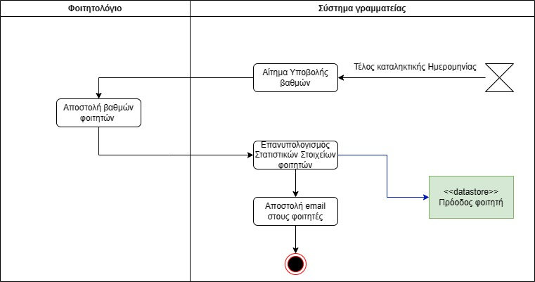

# ΠΧ7. Καταχώρηση Νέων Βαθμών

**Πρωτεύων Actor**: Ημερολόγιο Συστήματος 

**Ενδιαφερόμενοι**

- **Φοιτητής**: Θέλει να μπορεί βλέπει τους βαθμούς του.

**Προϋποθέσεις**: 
- Το φοιτητολόγιο είναι αυτό που καταχωρεί τους βαθμούς.
- Η καταλητική ημερομηνία έχει οριστεί από τους καθηγητές

## Βασική Ροή

### Καταχώρηση νέων βαθμών
1. Με το τέλος της καταληκτικής ημερομηνίας, το σύστημά μας στέλνει αίτημα υποβολής βαθμών των φοιτητών.
2. Το εξωτερικό σύστημα του φοιτητολογίου εισαγάγει λίστα με τους βαθμούς των φοιτητών στα μαθήματα που έχουν δηλώσει.
3. Το σύστημα ανανεώνει τα δεδομένα των φοιτητών και ενημερώνει τα στοιχεία προόδου του.
4. Το σύστημα στέλνει ενημερωτικό μήνυμα στους φοιτητές για τους νέους βαθμούς.

## Εναλλακτικές Ροές

*Σε οποιοδήποτε σημείο το λογισμικό καταρρέει.
1. Το Ημερολόγιο Συστήματος εκκινεί τη περίπτωση χρήσης από την αρχή.

## Διαγράμματα 
**Διάγραμμα Δραστηριοτήτων**

